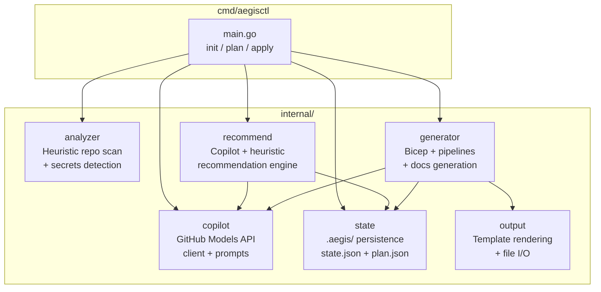
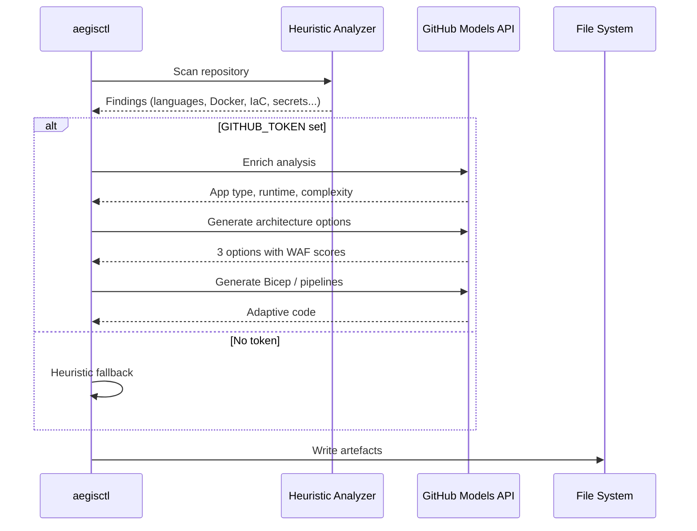

# Aegis

**Azure architecture advisor — powered by the Well-Architected Framework + GitHub Copilot.**

Aegis (`aegisctl`) analyzes an application repository and produces
**Azure Well-Architected, minimum-cost architecture recommendations**:
multi-option plans with WAF scores, Bicep IaC, Azure DevOps Pipelines CI/CD,
security remediation guidance, and AWS→Azure migration support.

Uses **GitHub Copilot** (via GitHub Models API) for intelligent analysis
and adaptive code generation — with full **heuristic fallback** for
offline use.

> **Default behaviour:** generate-only — nothing is deployed unless you
> explicitly opt in to autodeploy with approval gates.

---

## How it works

```mermaid
flowchart LR
    subgraph CLI["aegisctl"]
        init["init"] --> plan["plan"] --> apply["apply"]
    end
    repo([("Your Repo")]) --> init
    copilot([("GitHub Copilot\n(optional)")]) -.-> init
    copilot -.-> plan
    copilot -.-> apply
    apply --> bicep["Bicep IaC"]
    apply --> pipelines["Azure DevOps\nPipelines"]
    apply --> docs["Architecture Docs"]
```

1. **`init`** — scans the repository (languages, Docker, CI/CD, IaC, secrets, AWS usage) and enriches findings with GitHub Copilot. Saves state to `.aegis/state.json`.
2. **`plan`** — generates 3 architecture options ranked by fit, each with WAF scores, cost estimates, and migration steps. Interactive selection. Saves to `.aegis/plan.json`.
3. **`apply`** — produces all artefacts (Bicep, pipelines, docs) from the selected plan option.

---

## Workflow — init / plan / apply

All commands default to the current directory and are **idempotent** (safe to run multiple times).

```bash
# 1. Scan the repository and save analysis state
aegisctl init

# 2. Generate architecture options and pick one
aegisctl plan

# 3. Write IaC, pipelines, and docs (defaults to out/)
aegisctl apply

# Or specify a custom output directory
aegisctl apply --output custom/
```

### `init` — Repository analysis + Copilot enrichment

Scans the repository heuristically (languages, Docker, CI/CD, IaC, AWS
usage, secrets) and enriches the findings with GitHub Copilot when a
token is set. Saves state to `.aegis/state.json`.

```bash
aegisctl init [repoPath]   # defaults to .
```

If `.aegis/state.json` already exists, it is **refreshed** (not an error).

### `plan` — Multi-option architecture recommendations

Generates 3 architecture options (e.g., Container Apps, App Service, AKS)
ranked by fit, each with WAF scores, cost estimates, and migration steps.
Prompts for interactive selection. Saves plan to `.aegis/plan.json`.

```bash
aegisctl plan [repoPath]   # defaults to .
```

If `.aegis/plan.json` already exists, it is **replaced**.

### `apply` — Generate IaC, pipelines, and docs

Reads the plan and produces all artefacts. Uses Copilot for adaptive
generation or templates as fallback.

```bash
aegisctl apply [repoPath] [--output <dir>] [--deploy off|manual|auto] [--option <n>]
```

| Flag | Description | Default |
|---|---|---|
| `--output <dir>` | Output directory | `out/` |
| `--deploy off\|manual\|auto` | Deploy mode | `off` (generate-only) |
| `--option <n>` | Override the selected option (1-based) | plan selection |

Existing files in the output directory are **overwritten** safely.

### `analyze` — Quick analysis (no state)

Prints a repository analysis to stdout without saving state.

```bash
aegisctl analyze [repoPath]   # defaults to .
```

### Global flags

```
aegisctl --help       Show usage
aegisctl --version    Print version
```

### Environment variables

| Variable | Required | Description |
|---|---|---|
| `AEGIS_GITHUB_TOKEN` | No | Fine-grained PAT scoped to GitHub Models. **Preferred.** |
| `GITHUB_TOKEN` | No | Fallback when `AEGIS_GITHUB_TOKEN` is not set. |

Aegis checks `AEGIS_GITHUB_TOKEN` first, then `GITHUB_TOKEN`. If neither is
set it runs in heuristic-only mode (no Copilot). Using a dedicated variable
avoids conflicts with the auto-generated `GITHUB_TOKEN` in GitHub Actions.

---

## Architecture overview



### Module responsibilities

| Module | Purpose |
|---|---|
| `cmd/aegisctl` | CLI entry point — parses commands, orchestrates the workflow |
| `internal/analyzer` | Heuristic scanning: languages, Docker, CI/CD, IaC, AWS, secrets |
| `internal/copilot` | GitHub Models API client with structured prompts |
| `internal/recommend` | Generates architecture options (Copilot or heuristic fallback) |
| `internal/state` | Persists `.aegis/state.json` and `.aegis/plan.json` |
| `internal/generator` | Produces Bicep, Azure DevOps Pipelines, architecture docs |
| `internal/output` | Go `text/template` rendering + `WriteFile` helper |

---

## Generated artefacts

The `apply` command generates a complete, production-ready set of files:

| File | Description |
|---|---|
| `infra/main.bicep` | Azure Bicep template (adapts to selected architecture) |
| `infra/parameters.dev.json` | Dev environment parameters |
| `infra/parameters.prod.json` | Prod environment parameters |
| `pipelines/ci.yml` | CI pipeline (build + test + lint) |
| `pipelines/iac-validate.yml` | IaC validation pipeline |
| `pipelines/deploy.yml` | Gated deploy with environment approval |
| `docs/ARCHITECTURE.md` | **Detailed architecture** with Mermaid diagrams, resource inventory, naming, WAF scores |
| `docs/SECURITY.md` | Security posture + remediation steps |
| `docs/WAF_CHECKLIST.md` | WAF pillar checklist |

### Example: generated ARCHITECTURE.md

The architecture document includes:
- **Application profile** — type, language, complexity, infrastructure needs
- **Mermaid architecture diagram** — all Azure resources with naming conventions
- **Resource inventory table** — resource type, ARM type, dev/prod names, SKUs, purpose
- **Security architecture diagram** — Managed Identity + Key Vault + OIDC flow
- **CI/CD pipeline diagram** — Azure DevOps build → validate → gate → deploy
- **WAF scorecard** — visual bar chart per pillar with overall score
- **Alternative options** — other architectures considered with cost/WAF comparison
- **Migration steps** — for AWS→Azure scenarios

---

## Copilot integration



Copilot is used at every stage when available:
- **init**: enriches heuristic findings with app type, runtime, complexity analysis
- **plan**: generates architecture options tailored to the specific application
- **apply**: produces adaptive Bicep and pipeline code (not just templates)

---

## Development

### Prerequisites

- **Go 1.22+** — <https://go.dev/dl/>
- **GNU Make** (or compatible)
- **Azure CLI + Bicep** (optional, for IaC validation targets)
- **staticcheck** (optional, auto-installed by `make lint`)

### Quick start

```bash
git clone https://github.com/aegis/aegisctl.git
cd aegisctl

# Run the full local CI pipeline
make all

# Or individual steps
make build          # Compile binary → bin/aegisctl
make test           # Run tests with race detection
make vet            # Static analysis
make fmt            # Check formatting
make lint           # Run staticcheck
```

### Makefile targets

| Target | Description |
|---|---|
| `make all` | Full local CI: fmt → vet → lint → test → build |
| `make build` | Compile the binary into `bin/` |
| `make test` | Run all Go tests with `-race` |
| `make test-cover` | Run tests and print coverage summary |
| `make test-cover-html` | Generate an HTML coverage report |
| `make vet` | Run `go vet ./...` |
| `make fmt` | Check that all files are `gofmt`-formatted |
| `make fmt-fix` | Auto-format all Go source files |
| `make lint` | Run `staticcheck` (installs if missing) |
| `make build-all` | Cross-compile for Linux, macOS, and Windows |
| `make install` | Install binary to `/usr/local/bin` (Linux/WSL) |
| `make install-windows` | Cross-compile and install `.exe` to `~/bin` |
| `make clean` | Remove build artefacts and coverage files |
| `make bicep-build` | Validate Bicep with `az bicep build` |
| `make version` | Print version, commit, and build time |

### Project structure

```
aegisctl/
├── AGENTS.md                Agent instructions
├── Makefile                 Development targets
├── README.md                ← you are here
├── src/                     Go source (stdlib only)
│   ├── go.mod
│   ├── cmd/aegisctl/        CLI entry point (init / plan / apply)
│   └── internal/
│       ├── analyzer/        Heuristic repo scanning + secrets detection
│       ├── copilot/         GitHub Models API client + prompts
│       ├── generator/       Artefact generation (Bicep, pipelines, docs)
│       ├── output/          Template rendering + file I/O
│       ├── recommend/       Recommendation engine (Copilot + heuristic)
│       ├── state/           .aegis/ state persistence (state.json, plan.json)
│       ├── migrator/        AWS → Azure mapping (legacy)
│       ├── packer/          Pack generation (legacy)
│       └── scorer/          WAF scorecard (legacy)
├── infra/                   Reference Bicep templates
├── docs/                    Documentation
├── pipelines/               Azure DevOps CI, IaC validation, deploy, release
└── bin/                     Build output
```

### Running tests

```bash
make test               # All tests with race detector
make test-cover         # With coverage summary
make test-cover-html    # HTML coverage report
```

### Code conventions

- **Go stdlib only** — no third-party modules.
- **Bicep** for all Azure IaC — no ARM JSON, no Terraform.
- **Azure DevOps Pipelines** for CI/CD (releases published to GitHub Releases).
- No secrets or credentials in code — use `REDACTED` for placeholders.
- WAF always means **Well-Architected Framework** in this project.

---

## Quick links

| Resource | Path |
|---|---|
| Agent instructions | [AGENTS.md](AGENTS.md) |
| Architecture & WAF alignment | [docs/ARCHITECTURE.md](docs/ARCHITECTURE.md) |
| WAF Checklist | [docs/WAF_CHECKLIST.md](docs/WAF_CHECKLIST.md) |
| Security & Secrets guidance | [docs/SECURITY_AND_SECRETS.md](docs/SECURITY_AND_SECRETS.md) |
| AWS → Azure migration | [docs/AWS_MIGRATION.md](docs/AWS_MIGRATION.md) |
| Demo script | [docs/DEMO_SCRIPT.md](docs/DEMO_SCRIPT.md) |
| IaC & Pipeline decisions | [docs/IAC_AND_PIPELINE.md](docs/IAC_AND_PIPELINE.md) |
| RAI notes | [docs/RAI_NOTES.md](docs/RAI_NOTES.md) |

## References

- [Azure Well-Architected Framework](https://learn.microsoft.com/azure/well-architected/)
- [Azure Cloud Adoption Framework](https://learn.microsoft.com/azure/cloud-adoption-framework/)
- [Azure naming conventions](https://learn.microsoft.com/azure/cloud-adoption-framework/ready/azure-best-practices/resource-naming)
- [Bicep documentation](https://learn.microsoft.com/azure/azure-resource-manager/bicep/)
- [Azure DevOps Pipelines](https://learn.microsoft.com/azure/devops/pipelines/)
- [GitHub Models API](https://docs.github.com/en/github-models)

## License

[MIT](LICENSE)
