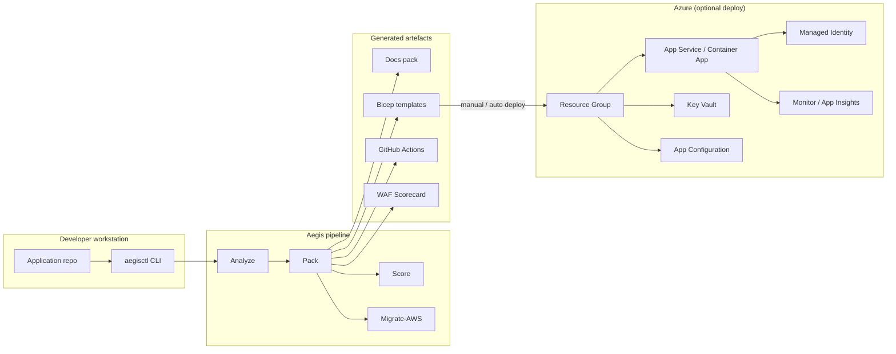

# Architecture — WAF-Aligned Decisions

> This document records the architecture decisions for Aegis-generated packs,
> aligned to the five pillars of the **Azure Well-Architected Framework (WAF)**.

---

## Terminology note

Throughout this document, **WAF** refers exclusively to the
**Azure Well-Architected Framework** — _not_ Web Application Firewall.

### Why WAF is the primary framework

The Well-Architected Framework provides pillar-by-pillar guidance for workload
architecture. It is the correct lens for evaluating _how_ an application is
built and operated on Azure.

The **Cloud Adoption Framework (CAF)** is contextual — it governs the _landing
zone_ (subscriptions, management groups, policies) in which the workload lives.
Aegis assumes a CAF-compliant landing zone already exists or will be provisioned
separately, and focuses its analysis on WAF.

---

## High-level architecture

---

## Pillar-by-pillar decisions

### 1. Reliability

| Decision | Rationale |
|---|---|
| Use Azure App Service or Container Apps (not VMs) | PaaS provides built-in health probes, auto-restart, and zone redundancy at lower operational cost. |
| Configure health endpoints | Liveness + readiness probes are scaffolded in generated IaC. |
| Multi-region is opt-in | Minimum-cost default is single-region; multi-region guidance is documented but not default. |

### 2. Security

| Decision | Rationale |
|---|---|
| Managed Identity first | Eliminates credential rotation and secret sprawl. |
| Key Vault for secrets that cannot use MI | Connection strings to third-party services, legacy APIs. |
| App Configuration for non-secret config | Feature flags, environment-specific settings — no secrets here. |
| No secrets in repo | Aegis scans and flags any detected secrets with remediation guidance. |

### 3. Cost Optimization

| Decision | Rationale |
|---|---|
| Minimum-viable SKU selection | Dev/test uses Free/Basic tiers; production uses Standard with autoscale. |
| Consumption-based where possible | Azure Functions Consumption plan, Container Apps with scale-to-zero. |
| Right-size recommendations | Scorecard flags over-provisioned resources. |

### 4. Operational Excellence

| Decision | Rationale |
|---|---|
| GitHub Actions for CI/CD | Native integration, no additional tooling. |
| Three-workflow pattern | `ci.yml` (build/test), `iac-validate.yml` (Bicep lint), `deploy.yml` (gated deploy). |
| Environment approvals | All deploys require GitHub Environment approval — no unattended production changes. |
| IaC-only changes | No portal/CLI drift; all mutations via Bicep. |

### 5. Performance Efficiency

| Decision | Rationale |
|---|---|
| CDN for static assets (if applicable) | Azure Front Door or CDN profile scaffolded when static files detected. |
| Caching guidance | Redis or in-memory caching recommendations based on workload type. |
| Autoscale rules | Scaffolded in Bicep with conservative defaults. |

---

## Key architectural constraints

1. **Generate-only by default** — Aegis never deploys unless the user opts in.
2. **Stdlib-only Go** — no third-party dependencies in the CLI.
3. **Bicep-only IaC** — no ARM JSON, no Terraform.
4. **GitHub Actions-only CI/CD** — no Jenkins, Azure DevOps, etc.
5. **CAF landing zone assumed** — Aegis does not provision subscriptions or
   management groups.

---

## References

- [Azure Well-Architected Framework](https://learn.microsoft.com/azure/well-architected/)
- [Cloud Adoption Framework](https://learn.microsoft.com/azure/cloud-adoption-framework/)
- [Bicep documentation](https://learn.microsoft.com/azure/azure-resource-manager/bicep/)
