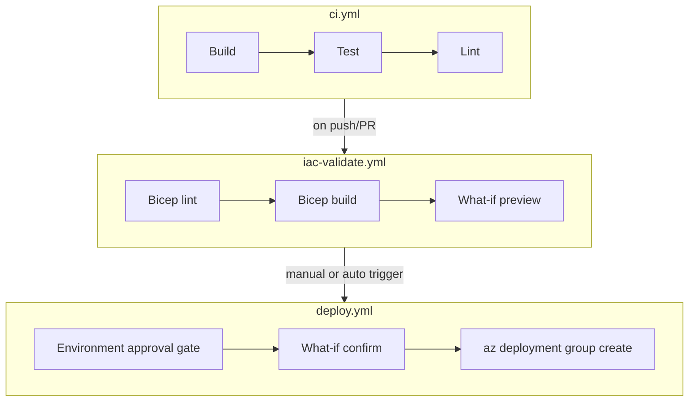

# IaC & Pipeline Strategy

> Describes the Bicep IaC strategy and GitHub Actions CI/CD pipeline design
> generated by Aegis.

---

## Bicep strategy

### Why Bicep (not ARM JSON or Terraform)?

| Criterion | Bicep | ARM JSON | Terraform |
|---|---|---|---|
| Azure-native | ✅ First-class | ✅ Native but verbose | ❌ Third-party |
| Readability | ✅ Clean DSL | ❌ Verbose JSON | ⚠️ HCL learning curve |
| Tooling | ✅ VS Code extension, linter, what-if | ⚠️ Limited | ✅ Rich |
| State management | ✅ None (Azure is the state) | ✅ None | ❌ Requires state file |
| Module ecosystem | ✅ Azure Verified Modules | ❌ Limited | ✅ Terraform Registry |

Aegis generates **Bicep only** to maintain a single, Azure-native IaC standard.

### File structure

```
infra/
├── main.bicep              ← orchestration / entry point
├── modules/
│   ├── appService.bicep    ← TODO: App Service module
│   ├── keyVault.bicep      ← TODO: Key Vault module
│   ├── appConfig.bicep     ← TODO: App Configuration module
│   ├── monitoring.bicep    ← TODO: Application Insights + Log Analytics
│   └── identity.bicep      ← TODO: Managed Identity + RBAC assignments
├── parameters.dev.json     ← dev environment parameters
└── parameters.prod.json    ← production environment parameters
```

### Naming conventions

All resources follow the pattern: `{abbreviation}-{workload}-{environment}-{region}-{instance}`

Examples:
- `app-myapp-dev-eus-001` (App Service)
- `kv-myapp-prod-eus-001` (Key Vault)
- `appcs-myapp-dev-eus-001` (App Configuration)

Reference: [Azure naming conventions](https://learn.microsoft.com/azure/cloud-adoption-framework/ready/azure-best-practices/resource-naming)

### Minimum-cost defaults

| Resource | Dev SKU | Prod SKU |
|---|---|---|
| App Service Plan | F1 (Free) | S1 (Standard) |
| Key Vault | Standard | Standard |
| App Configuration | Free | Standard |
| Application Insights | Free tier (5 GB/month) | Pay-as-you-go |
| Log Analytics | Free tier (500 MB/day) | Pay-as-you-go |

---

## Pipeline design

### Three-workflow pattern



### Workflow details

#### 1. `ci.yml` — Build & Test

- **Trigger:** Push to any branch, PR to `main`.
- **Steps:**
  1. Checkout code.
  2. Set up Go.
  3. `go build ./...`
  4. `go test ./...`
  5. `go vet ./...`
  6. Secrets scan (gitleaks).
- **No deployment** — purely validation.

#### 2. `iac-validate.yml` — Bicep Validation

- **Trigger:** Push/PR that modifies `infra/**`.
- **Steps:**
  1. Checkout code.
  2. Set up Bicep CLI.
  3. `bicep lint infra/main.bicep`
  4. `bicep build infra/main.bicep`
  5. `az deployment group what-if` (preview only — no mutation).
- **No deployment** — preview and lint only.

#### 3. `deploy.yml` — Gated Deployment

- **Trigger:**
  - `workflow_dispatch` (manual) — always.
  - Push to `main` (auto mode) — only if deploy mode is `auto`.
- **Environment:** `production` (requires approval).
- **Steps:**
  1. Checkout code.
  2. Azure login (OIDC federation — no stored secrets).
  3. `az deployment group what-if` (confirmation).
  4. ⏸️ **Environment approval gate** — human must approve.
  5. `az deployment group create --mode Incremental` (never Complete).
- **Guardrails:**
  - Deployment mode is always `Incremental` (never `Complete`).
  - Environment approval is mandatory regardless of deploy mode.
  - What-if output is available for review before approval.

### Deploy modes

| Mode | ci.yml | iac-validate.yml | deploy.yml trigger | Approval |
|---|---|---|---|---|
| `generate` (default) | ✅ Runs | ✅ Runs | ❌ Not triggered | N/A |
| `manual` | ✅ Runs | ✅ Runs | `workflow_dispatch` | ✅ Required |
| `auto` | ✅ Runs | ✅ Runs | Push to `main` | ✅ Required |

### CI-safe test strategy

All tests must be safe to run in CI without Azure credentials:

1. **Unit tests** — mock all Azure SDK calls.
2. **Bicep validation** — `bicep build` is offline, no Azure connection needed.
3. **Integration tests** — only run in deploy pipeline with real credentials.
4. **Secrets scan** — offline, runs against local files.

---

## References

- [Bicep documentation](https://learn.microsoft.com/azure/azure-resource-manager/bicep/)
- [Azure Verified Modules](https://aka.ms/avm)
- [GitHub Actions — environments](https://docs.github.com/actions/deployment/targeting-different-environments/using-environments-for-deployment)
- [OIDC federation for Azure](https://learn.microsoft.com/azure/developer/github/connect-from-azure)
